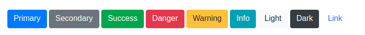
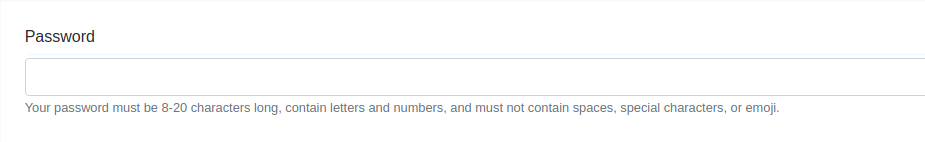
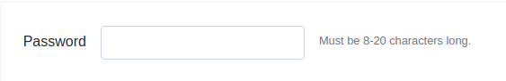
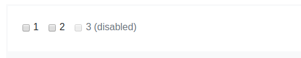
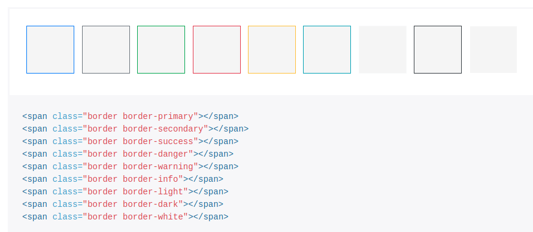
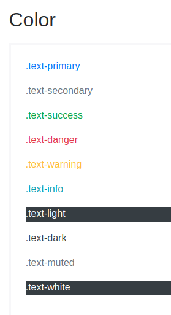
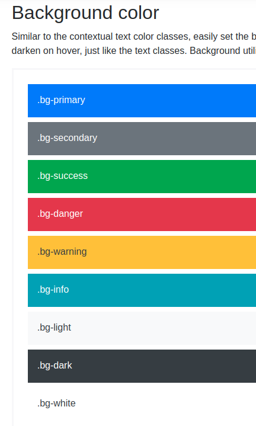

**Xiang Wang @ 2016-11-16 23:11:08**

# Menu
* [Html reference](../README.md)

# get started
* [starter template](./basic.html)
* [Official documentation](https://getbootstrap.com/docs/4.1/getting-started/introduction/)


# Content  
## Reboot  

## [typography](https://getbootstrap.com/docs/4.1/content/typography/)
the look of text
* Heading
* display heading
* lead
* inline text elements
    * mark
    * del
    * s
    * ins
    * u
    * small
    * strong
    * em
* abbreviations
* [blockquotes](https://getbootstrap.com/docs/4.1/content/typography/#blockquotes)  
use `blockquotes` to represent blockquote
    * example
    ```
    <blockquote class="blockquote">
      <p class="mb-0">Lorem ipsum dolor sit amet, consectetur adipiscing elit. Integer posuere erat a ante.</p>
    </blockquote>
    ```
    * naming a source
    ```
    <blockquote class="blockquote">
      <p class="mb-0">Lorem ipsum dolor sit amet, consectetur adipiscing elit. Integer posuere erat a ante.</p>
      <footer class="blockquote-footer">Someone famous in <cite title="Source Title">Source Title</cite></footer>
    </blockquote>
    ```
    * alignment
    ```
    <blockquote class="blockquote text-right">
      <p class="mb-0">Lorem ipsum dolor sit amet, consectetur adipiscing elit. Integer posuere erat a ante.</p>
      <footer class="blockquote-footer">Someone famous in <cite title="Source Title">Source Title</cite></footer>
    </blockquote>
    ```

## Code

## [Images](https://getbootstrap.com/docs/4.1/content/images/)
* use `.img-fluid` to make a responsive image
```

```
* user `.img-thumbnail` to make a image rounded by 1px  
``
* Aligning Images
    * rounded
    * float-left|float-right
    * mx-auto
    * d-block

## Tables
```
<table class="table">
  <thead>
    <tr>
      <th scope="col">#</th>
      <th scope="col">First</th>
      <th scope="col">Last</th>
      <th scope="col">Handle</th>
    </tr>
  </thead>
  <tbody>
    <tr>
      <th scope="row">1</th>
      <td>Mark</td>
      <td>Otto</td>
      <td>@mdo</td>
    </tr>
    <tr>
      <th scope="row">2</th>
      <td>Jacob</td>
      <td>Thornton</td>
      <td>@fat</td>
    </tr>
    <tr>
      <th scope="row">3</th>
      <td>Larry</td>
      <td>the Bird</td>
      <td>@twitter</td>
    </tr>
  </tbody>
</table>
```
* Striped rows
Use `.table-striped` to add zebra-striping  使用 `.table-striped` 来产生间隔条纹
    * Change the color:
    ```
    .table-striped>tbody>tr:nth-child(odd)>td,
    .table-striped>tbody>tr:nth-child(odd)>th {
      background-color: red; // Choose your own color here
    }
    ```


## Figures


# [Components](https://getbootstrap.com/docs/4.1/components/alerts/)

## [Buttons](https://getbootstrap.com/docs/4.1/components/buttons/)
* Example  

```
<button type="button" class="btn btn-primary">Primary</button>
<button type="button" class="btn btn-secondary">Secondary</button>
<button type="button" class="btn btn-success">Success</button>
<button type="button" class="btn btn-danger">Danger</button>
<button type="button" class="btn btn-warning">Warning</button>
<button type="button" class="btn btn-info">Info</button>
<button type="button" class="btn btn-light">Light</button>
<button type="button" class="btn btn-dark">Dark</button>
<button type="button" class="btn btn-link">Link</button>
```

## [Dropdowns](https://getbootstrap.com/docs/4.1/components/dropdowns/)
* Example
```
<div class="dropdown">
  <button class="btn btn-secondary dropdown-toggle" type="button" id="dropdownMenuButton" data-toggle="dropdown" aria-haspopup="true" aria-expanded="false">
    Dropdown button
  </button>
  <div class="dropdown-menu" aria-labelledby="dropdownMenuButton">
    <a class="dropdown-item" href="#">Action</a>
    <a class="dropdown-item" href="#">Another action</a>
    <a class="dropdown-item" href="#">Something else here</a>
  </div>
</div>
```
* Methods
```
$().dropdown('toggle')
```

## [Forms](https://getbootstrap.com/docs/4.1/components/forms/)
### Layout
#### Form grid
* [ ] form row
* Horizontal form

#### Inline Forms
```
<form class="form-inline">
</form>
```

### [Help Text](https://getbootstrap.com/docs/4.1/components/forms/#help-text)

```
<label for="inputPassword5">Password</label>
<input type="password" id="inputPassword5" class="form-control" aria-describedby="passwordHelpBlock">
<small id="passwordHelpBlock" class="form-text text-muted">
  Your password must be 8-20 characters long, contain letters and numbers, and must not contain spaces, special characters, or emoji.
</small>
```


```
<form class="form-inline">
  <div class="form-group">
    <label for="inputPassword6">Password</label>
    <input type="password" id="inputPassword6" class="form-control mx-sm-3" aria-describedby="passwordHelpInline">
    <small id="passwordHelpInline" class="text-muted">
      Must be 8-20 characters long.
    </small>
  </div>
</form>
```


### Custom forms
#### Checkboxes and radios
    * inline  
    
    ```python
    <div class="form-check form-check-inline">
        <input class="form-check-input" type="checkbox" id="inlineCheckbox1" value="option1">
        <label class="form-check-label" for="inlineCheckbox1">1</label>
    </div>
    <div class="form-check form-check-inline">
        <input class="form-check-input" type="checkbox" id="inlineCheckbox2" value="option2">
        <label class="form-check-label" for="inlineCheckbox2">2</label>
    </div>
    <div class="form-check form-check-inline">
        <input class="form-check-input" type="checkbox" id="inlineCheckbox3" value="option3" disabled>
        <label class="form-check-label" for="inlineCheckbox3">3 (disabled)</label>
    </div>
    ```

    
    ```html
    <div class="form-check form-check-inline">
        <input class="form-check-input" type="radio" name="inlineRadioOptions" id="inlineRadio1" value="option1">
        <label class="form-check-label" for="inlineRadio1">1</label>
    </div>
    <div class="form-check form-check-inline">
        <input class="form-check-input" type="radio" name="inlineRadioOptions" id="inlineRadio2" value="option2">
        <label class="form-check-label" for="inlineRadio2">2</label>
    </div>
    <div class="form-check form-check-inline">
        <input class="form-check-input" type="radio" name="inlineRadioOptions" id="inlineRadio3" value="option3" disabled>
        <label class="form-check-label" for="inlineRadio3">3 (disabled)</label>
    </div>
    ```

## [List group](https://getbootstrap.com/docs/4.1/components/list-group/)
* [custom content](https://getbootstrap.com/docs/4.1/components/list-group/#custom-content)
```html
<div class="list-group">
  <a href="#" class="list-group-item list-group-item-action flex-column align-items-start active">
    <div class="d-flex w-100 justify-content-between">
      <h5 class="mb-1">List group item heading</h5>
      <small>3 days ago</small>
    </div>
    <p class="mb-1">Donec id elit non mi porta gravida at eget metus. Maecenas sed diam eget risus varius blandit.</p>
    <small>Donec id elit non mi porta.</small>
  </a>
  <a href="#" class="list-group-item list-group-item-action flex-column align-items-start">
    <div class="d-flex w-100 justify-content-between">
      <h5 class="mb-1">List group item heading</h5>
      <small class="text-muted">3 days ago</small>
    </div>
    <p class="mb-1">Donec id elit non mi porta gravida at eget metus. Maecenas sed diam eget risus varius blandit.</p>
    <small class="text-muted">Donec id elit non mi porta.</small>
  </a>
  <a href="#" class="list-group-item list-group-item-action flex-column align-items-start">
    <div class="d-flex w-100 justify-content-between">
      <h5 class="mb-1">List group item heading</h5>
      <small class="text-muted">3 days ago</small>
    </div>
    <p class="mb-1">Donec id elit non mi porta gravida at eget metus. Maecenas sed diam eget risus varius blandit.</p>
    <small class="text-muted">Donec id elit non mi porta.</small>
  </a>
</div>
```

## [Modal](https://getbootstrap.com/docs/4.1/components/modal/)

### example
```html
<!-- Button trigger modal -->
<button type="button" class="btn btn-primary" data-toggle="modal" data-target="#exampleModal">
  Launch demo modal
</button>

<!-- Modal -->
<div class="modal fade" id="exampleModal" tabindex="-1" role="dialog" aria-labelledby="exampleModalLabel" aria-hidden="true">
  <div class="modal-dialog" role="document">
	<div class="modal-content">
	  <div class="modal-header">
		<h5 class="modal-title" id="exampleModalLabel">Modal title</h5>
		<button type="button" class="close" data-dismiss="modal" aria-label="Close">
		  <span aria-hidden="true">&times;</span>
		</button>
	  </div>
	  <div class="modal-body">
		...
	  </div>
	  <div class="modal-footer">
		<button type="button" class="btn btn-secondary" data-dismiss="modal">Close</button>
		<button type="button" class="btn btn-primary">Save changes</button>
	  </div>
	</div>
  </div>
</div>
```

### [Verying modal content](https://getbootstrap.com/docs/4.1/components/modal/#varying-modal-content)  
Have a bunch of buttonss that all trigger the same modal with slightly different contents
1. add data-* attributes to the button  
    ```
    <button type="button" class="btn btn-primary" data-toggle="modal" data-target="#exampleModal" data-whatever="@mdo">Open modal for @mdo</button>
    <button type="button" class="btn btn-primary" data-toggle="modal" data-target="#exampleModal" data-whatever="@fat">Open modal for @fat</button>
    <button type="button" class="btn btn-primary" data-toggle="modal" data-target="#exampleModal" data-whatever="@getbootstrap">Open modal for @getbootstrap</button>
    ```

2. set  
    ``` 
    <div class="modal fade" id="exampleModal" tabindex="-1" role="dialog" aria-labelledby="exampleModalLabel" aria-hidden="true">
      <div class="modal-dialog" role="document">
        <div class="modal-content">
          <div class="modal-header">
            <h5 class="modal-title" id="exampleModalLabel">New message</h5>
            <button type="button" class="close" data-dismiss="modal" aria-label="Close">
              <span aria-hidden="true">&times;</span>
            </button>
          </div>
          <div class="modal-body">
            <form>
              <div class="form-group">
                <label for="recipient-name" class="col-form-label">Recipient:</label>
                <input type="text" class="form-control" id="recipient-name">
              </div>
              <div class="form-group">
                <label for="message-text" class="col-form-label">Message:</label>
                <textarea class="form-control" id="message-text"></textarea>
              </div>
            </form>
          </div>
          <div class="modal-footer">
            <button type="button" class="btn btn-secondary" data-dismiss="modal">Close</button>
            <button type="button" class="btn btn-primary">Send message</button>
          </div>
        </div>
      </div>
    </div>
    ```

3. add trigger js to the button  
    ```
    $('#exampleModal').on('show.bs.modal', function (event) {
      var button = $(event.relatedTarget) // Button that triggered the modal
      var recipient = button.data('whatever') // Extract info from data-* attributes
      // If necessary, you could initiate an AJAX request here (and then do the updating in a callback).
      // Update the modal's content. We'll use jQuery here, but you could use a data binding library or other methods instead.
      var modal = $(this)
      modal.find('.modal-title').text('New message to ' + recipient)
      modal.find('.modal-body input').val(recipient)
    })
    ```

### [Size](https://getbootstrap.com/docs/4.1/components/modal/#optional-sizes)
```
<!-- Large modal -->
<button type="button" class="btn btn-primary" data-toggle="modal" data-target=".bd-example-modal-lg">Large modal</button>

<div class="modal fade bd-example-modal-lg" tabindex="-1" role="dialog" aria-labelledby="myLargeModalLabel" aria-hidden="true">
  <div class="modal-dialog modal-lg">
    <div class="modal-content">
      ...
    </div>
  </div>
</div>

<!-- Small modal -->
<button type="button" class="btn btn-primary" data-toggle="modal" data-target=".bd-example-modal-sm">Small modal</button>

<div class="modal fade bd-example-modal-sm" tabindex="-1" role="dialog" aria-labelledby="mySmallModalLabel" aria-hidden="true">
  <div class="modal-dialog modal-sm">
    <div class="modal-content">
      ...
    </div>
  </div>
</div>
```

### [options](https://getbootstrap.com/docs/4.1/components/modal/#options)
    ```
    $('#myModal').modal(options)
    ```
### [methods](https://getbootstrap.com/docs/4.1/components/modal/#methods)
    * $('#myModal').modal('hide')

### TODO
* [ ] events


## [Navs](https://getbootstrap.com/docs/4.1/components/navs/)
* [example](./navs.html)
```html
<ul class="nav">
  <li class="nav-item">
    <a class="nav-link active" href="#">Active</a>
  </li>
  <li class="nav-item">
    <a class="nav-link" href="#">Link</a>
  </li>
  <li class="nav-item">
    <a class="nav-link" href="#">Link</a>
  </li>
  <li class="nav-item">
    <a class="nav-link disabled" href="#">Disabled</a>
  </li>
</ul>
```
* useful class:
    * `.nav`: 使用nav
    * `.active`: 激活状态
    * `.disabled`: 无法点击
    * `.justify-content-center | .justify-content-end`: 导航栏位置
    * `.flex-column`: 竖直的导航栏
    * `.nav-tabs`: 分页标签样式
    * `.nav-pills`: 片状样式
    * `.nav-fill`: 填充状态
    * `.nav-justifyied`: 统一大小

## [Navbar](https://getbootstrap.com/docs/4.1/components/navbar/)
The **navbar** is different from **nav**. It means a different place while the navs represent the related data but in different tab.
You can get more information from [here](https://stackoverflow.com/questions/14022135/in-twitter-bootstrap-what-is-the-difference-between-the-navbar-and-nav-pills) and [there](https://ux.stackexchange.com/questions/23527/what-is-the-difference-between-a-navigation-bar-and-tabs)
* example
```html
<nav class="navbar navbar-expand-lg navbar-light bg-light">
  <a class="navbar-brand" href="#">Navbar</a>
  <button class="navbar-toggler" type="button" data-toggle="collapse" data-target="#navbarNavDropdown" aria-controls="navbarNavDropdown" aria-expanded="false" aria-label="Toggle navigation">
    <span class="navbar-toggler-icon"></span>
  </button>
  <div class="collapse navbar-collapse" id="navbarNavDropdown">
    <ul class="navbar-nav">
      <li class="nav-item active">
        <a class="nav-link" href="#">Home <span class="sr-only">(current)</span></a>
      </li>
      <li class="nav-item">
        <a class="nav-link" href="#">Features</a>
      </li>
      <li class="nav-item">
        <a class="nav-link" href="#">Pricing</a>
      </li>
      <li class="nav-item dropdown">
        <a class="nav-link dropdown-toggle" href="#" id="navbarDropdownMenuLink" data-toggle="dropdown" aria-haspopup="true" aria-expanded="false">
          Dropdown link
        </a>
        <div class="dropdown-menu" aria-labelledby="navbarDropdownMenuLink">
          <a class="dropdown-item" href="#">Action</a>
          <a class="dropdown-item" href="#">Another action</a>
          <a class="dropdown-item" href="#">Something else here</a>
        </div>
      </li>
    </ul>
  </div>
</nav>
```

## [Scrollspy](https://getbootstrap.com/docs/4.0/components/scrollspy/)
* [example](./scrollsby.html)
```
<nav id="navbar-example2" class="navbar navbar-light bg-light">
  <a class="navbar-brand" href="#">Navbar</a>
  <ul class="nav nav-pills">
    <li class="nav-item">
      <a class="nav-link" href="#fat">@fat</a>
    </li>
    <li class="nav-item">
      <a class="nav-link" href="#mdo">@mdo</a>
    </li>
    <li class="nav-item dropdown">
      <a class="nav-link dropdown-toggle" data-toggle="dropdown" href="#" role="button" aria-haspopup="true" aria-expanded="false">Dropdown</a>
      <div class="dropdown-menu">
        <a class="dropdown-item" href="#one">one</a>
        <a class="dropdown-item" href="#two">two</a>
        <div role="separator" class="dropdown-divider"></div>
        <a class="dropdown-item" href="#three">three</a>
      </div>
    </li>
  </ul>
</nav>
<div data-spy="scroll" data-target="#navbar-example2" data-offset="0">
  <h4 id="fat">@fat</h4>
  <p>...</p>
  <h4 id="mdo">@mdo</h4>
  <p>...</p>
  <h4 id="one">one</h4>
  <p>...</p>
  <h4 id="two">two</h4>
  <p>...</p>
  <h4 id="three">three</h4>
  <p>...</p>
</div>
```
* How it works:  
When spying on elements other than the `<body>`, be sure to have a `height` set and `overflow-y: scroll;` applied.


# [Utilities](https://getbootstrap.com/docs/4.0/utilities/borders/)

## [Borders](https://getbootstrap.com/docs/4.0/utilities/borders/)
* Border-subtractive
    * border
    * border-top
    * border-right
    * border-bottom
    * border-left
* Border-color:

* Border-radius:
    * rounded
    * rounded-top
    * rounded-left
    * rounded-circle
    * rounded-0

## [Colors](https://getbootstrap.com/docs/4.0/utilities/colors/)
* Color  

* Background  


## [Display](https://getbootstrap.com/docs/4.1/utilities/display/)
* inline

## [flex](https://getbootstrap.com/docs/4.1/utilities/flex/)
* example:
```
format: d(-breakpoint)(-inline)?-flex
<div class="d-flex p-2 bd-highlight">I'm a flexbox container!</div>
<div class="d-inline-flex p-2 bd-highlight">I'm and inline flexbox container!</div>
```
* direction:
    * `flex(-breakpoint)-row(-reverse)?`: `flex-sm-row-rever`
    * `flex(-breakpoint)-column(-reverse)?`: `flex-md-column`
* Justify-content: *how the display in the main axis*
    * `.justify-content(-breakpoint)-|end|center|between|around`
* Align-items: *how the display in the multi main axis*
    * `.align-items(-breakpoint)-start|end|center|baseline|stretch`
* auto margins
    * `mr-auto`: pushing items to the right
    * `ml-auto`: pushing items to the left
* fill: *use .flex-fill to fore them into equal widths* `.flex(-breakpoint)-fill`
* todolist:
    * [ ] grow and shrink
    * [ ] wrap
    * [ ] order
    * [ ] align content

## [Float](https://getbootstrap.com/docs/4.0/utilities/float/)
```
<div class="float-sm-left">Float left on viewports sized SM (small) or wider</div><br>
<div class="float-md-left">Float left on viewports sized MD (medium) or wider</div><br>
<div class="float-lg-left">Float left on viewports sized LG (large) or wider</div><br>
<div class="float-xl-left">Float left on viewports sized XL (extra-large) or wider</div><br>
```

## [Position](https://getbootstrap.com/docs/4.1/utilities/position/)
* Common values:
    * position-static|relative|absolute|fixed|sticky
    * fixed-top
    * fixed-bottom
    * sticky-top: the element will only be fixed after you scroll past it

## [Shadows](https://getbootstrap.com/docs/4.1/utilities/shadows/)
```
<div class="shadow-none p-3 mb-5 bg-light rounded">No shadow</div>
<div class="shadow-sm p-3 mb-5 bg-white rounded">Small shadow</div>
<div class="shadow p-3 mb-5 bg-white rounded">Regular shadow</div>
<div class="shadow-lg p-3 mb-5 bg-white rounded">Larger shadow</div>
```

## [Spacing](https://getbootstrap.com/docs/4.1/utilities/spacing/)
format: `{property}{sides}-{breakpoint}-{size} | {property}{sides}-{size}`
* property:
    * m - margin
    * p - padding
* sides:
    * t|b|l|r top|bottom|left|right
    * x|y left and right | top and bottom
    * blank set margin and padding on all 4 sides
* size:
    * 0|1|2|3|4|5|auto
* mx-auto: horizontally centering fixed

# [Extend](https://getbootstrap.com/docs/4.1/extend/approach/)
* [ ] Approach
## [Icons](https://getbootstrap.com/docs/4.1/extend/icons/)
* [Font Awesome](https://fontawesome.com/)
    * basic example
    ```
    <link rel="stylesheet" href="https://use.fontawesome.com/releases/v5.0.13/css/all.css" integrity="sha384-DNOHZ68U8hZfKXOrtjWvjxusGo9WQnrNx2sqG0tfsghAvtVlRW3tvkXWZh58N9jp" crossorigin="anonymous">
    <i class="fas fa-camera-retro"></i>
    ```
    * [find your icons](https://fontawesome.com/icons?d=gallery)
        * delete: `<i class="fas fa-minus-circle"></i>`
        * plus: `<i class="fas fa-plus"></i>`
* [ ] Iconic
* [ ] Octicons


# 其他
* 通用
    * `m-a m-l/r/t/b p-a-sm` 设置margin
    * `p-a p-l/r/t/b p-a-sm` 设置padding
* 位置
    * `row` 设置div被下面的div撑开
* [珊格系统](./grid珊格.html)
* [导航栏](./nav导航栏.html)
* [文字](./text文字.html)
* [form输入](./form.html)
* [弹出框](./popover弹出框.html)
* [按钮示例](./button.html) [按钮文档](./button.md)
